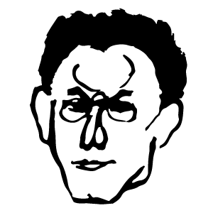

# Home

This website commemorates the work of the German art historian and philosopher Max Raphael \(1889-1952\). Maintained by a small group of editors, the Max Raphael Project aims to open up Max Raphael's writings to an English-speaking audience for purposes of research and education. The presented texts are subject to change and new material is constantly being added. Please feel free to contact one of the editors in case you find any errors or would like to contribute to the development of the website.

## Recent publications

* **2016:** [The Invention of Expressionism: Critical Writings 1910-1913](https://amzn.com/9492027097), a collection of Max Raphael's early writings, translated by [Patrick Healy](http://patrick-healy.com/) and published by [November Editions](http://novembereditions.com/).

* **2015:** [Picasso / Marx and Socialist Realism in France](http://a.co/2re4pSA) by [Sarah Wilson](http://courtauld.ac.uk/people/sarah-wilson). Contains an English translation of Max Raphael's _Proudhon, Marx, Picasso_. Published by [Liverpool University Press](https://liverpooluniversitypress.co.uk/products/60692).
